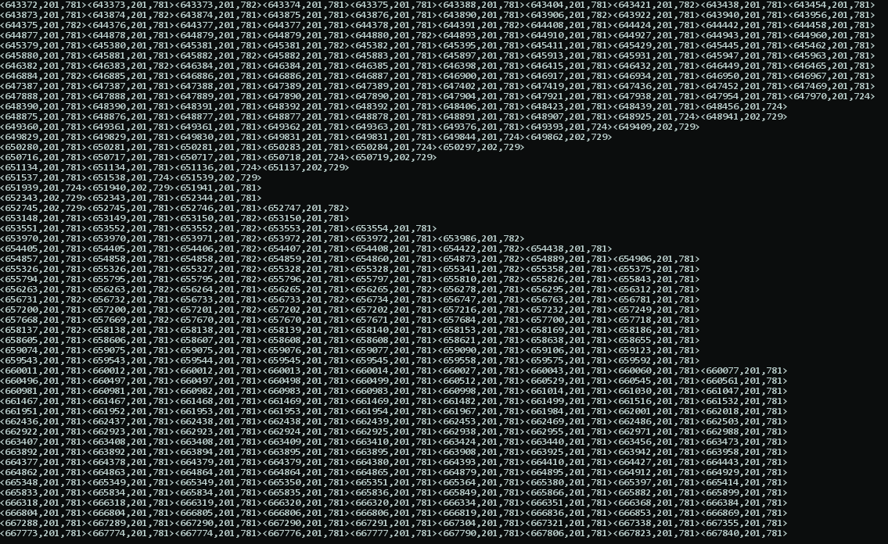

#Arduino-CEP

Partially based on this: https://github.com/igormiktor/arduino-EventManager

Current approach is to use a queue buffer to store event and perform operations,
such as filtering and arithmetic. Goal is also to perform operations on multiple
queues, like merging.

Here is how you can use it:

    #include "cep.h"

    ComplexEventManager cep;

    void listener(int eventCode, int eventParam)
    {
      Serial.println("got event to process");
    }

    void setup()
    {
      Serial.begin(9600);
      lastReadS1 = millis();
      lastReadS2 = millis();

      //cep.addListener(ComplexEventManager::kEventSensor1, listener);
      //cep.addListener(ComplexEventManager::kEventSensor2, listener);
    }

    void loop()
    {
      int s0 = analogRead(A0);
      if (s0 > 700)
        cep.queueEvent(ComplexEventManager::kEventSensor1, s0);
      int s1 = analogRead(A1);
      if (s1 > 700)
        cep.queueEvent(ComplexEventManager::kEventSensor2, s1);

      delay(400);
      //cep.filterGreater(700);
      cep.dump();
      cep.trigger();
    }

Here is the `Serial` output logging 2 light sensors. We produce data every 400ms
(well not really, we wait 400ms after reading new value). Value in the window are
filtered by value. The window only contains 4s old event so it behave like a real
temporal window.

If you use a `Fifo` instead of the `TemporalFifo` you have a spatial window, corresponding
to query such as “last n element satisfying constraints”

